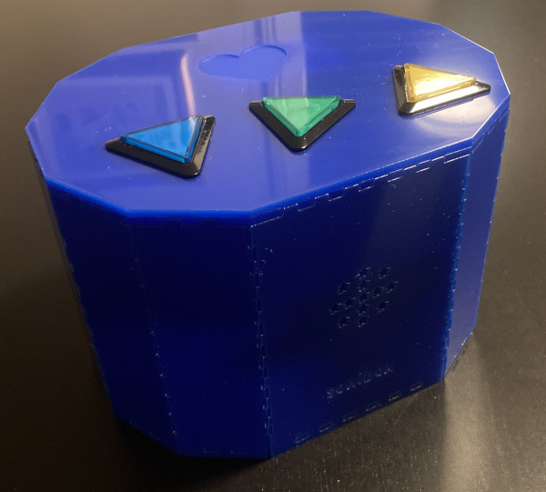

# sonibox

A music box. Plays music from a specific folder when an RFID tag is placed on the reader.
If you want to build this, e.g., for your kid, I highly recommend to add more than 5 songs 
to any given playlist... or add more later ;)

## Approximate BOM, but you can use similar parts, vary as needed!

- [Raspberry Pi Pico 2040](https://www.raspberrypi.com/products/raspberry-pi-pico/)
- An MFRC522 RFID reader, e.g., [this one](https://www.velleman.eu/products/view/arduino-compatible-rfid-read-and-write-module-vma405/?id=435568&lang=en)
- [DFRobot Mini MP3 player](https://wiki.dfrobot.com/DFPlayer_Mini_SKU_DFR0299) and a microSD card with music
- [Speaker](https://www.digikey.ch/de/products/detail/pui-audio-inc/ASE06008MR-LW150-R/4700909)
- [Battery pack with charging circuit](https://www.dfrobot.com/product-2578.html)
- [Three triangle buttons](https://www.adafruit.com/product/4187)
- USB C panel mount to charge battery from outside
- Panel mount push button soldered to battery On/Off switch for external control
- Standoffs, screws, heat inserts, wires.
- PCB (see `pcb` folder)
- Laser cut enclosure (see `enclosure` folder)

## PCB 

The PCB is designed in KiCad, see the `pcb` folder. 
Production files for JLCPCB are in the `pcb/jlcpcb` folder. 
Assembly needs to be done by hand using through-hole components.

For the connectors you can use any 2.54mm pitch pin headers or 
similar sized Molex connectors (as a nice alternative).

## Enclosure

An outline of the enclosure is shown in the `enclosure` folder.
This is designed for 3mm acrylic. 
Many boxes are possible, this is just one example I liked.
Check out [this site](https://boxes.hackerspace-bamberg.de/) for more ideas!

## Firmware 

The firmware is written in Rust and uses 
[embassy](https://embassy.dev/) as the async executor. 
After 5 min of inactivity, the box will stop polling the RFID reader 
to save power, however, the current version does not put the MP3 player 
or the power button LED (if present) to sleep. A future version could however 
do that! However, using a beefy battery helps a lot even with these shortcomings.

A shout out to [1-rafael-1](https://github.com/1-rafael-1/), the maintainer of 
the [dfplayer-async](https://docs.rs/dfplayer-async/latest/dfplayer_async/) crate. 
Also a big thank you to the [embassy](https://embassy.dev/) team for this amazing tool 
and for fostering a very friendly and helpful community!

## Todo

- [ ] Add a watchdog to reset the Pico if some task gets stuck
- [ ] Add functionality to really put all power drawing components to sleep after inactivity (requires hardware mods)
- [ ] Add some better LED animations when the music plays. Something random? 

## License

This project is licensed under the MIT License - see the [LICENSE](LICENSE) file for details.
